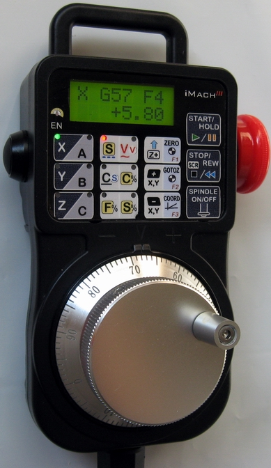

# iMach P4-S → KFLOP / KMotionCNC Pendant Bridge

   
  <em>The VistaCNC iMach III P4-S — the pendant this bridge drives. 
  Photo courtesy of <a href="https://www.vistacnc.com/b01_pendant_P4_P4S/pendant_P4_P4S.htm">VistaCNC</a>.</em>

> ⚠️ **Update KMotion first.** This bridge needs KFLOP/KMotionCNC fixes that first shipped in
> **KMotion 5.4.4** — **install or update to KMotion 5.4.4 (or newer) before loading the pendant
> code.** Older versions will not work correctly.

Run a **VistaCNC iMach III P4-S USB pendant** with **KMotionCNC** on a **Dynomotion KFLOP**. A
small Windows app (the "bridge") relays the pendant to your machine — you run it, no coding required.

**Getting the pendant:** buy it in the **LinuxCNC firmware** (recommended), or reflash an existing
Mach3-firmware unit — a few minutes, and the [Quick start](#quick-start) walks through the firmware
and driver setup either way. This bridge is what lets the pendant drive KMotionCNC — the job the
stock Mach3 plugin can't do.

The pendant becomes a first-class control device on a KFLOP machine: step / velocity /
continuous jogging on the MPG wheel, feed & spindle overrides, work-offset zero,
go-to-zero, control lock, and cycle start / hold / stop / E-stop — all following
VistaCNC's LinuxCNC-edition manual. Speed and feel are tuned in a plain-text
`pendant.conf` (**edit + restart, no rebuild**), and a **USB-drop watchdog** stops a
jog if the pendant's input stalls mid-motion.

Built and validated on a Bridgeport-style SuperMax knee-mill conversion (closed-loop
steppers, switchable knee/quill on Z, open-loop rotary A) driven by a **KFLOP**.

**Kogna?** It *should* also run on Dynomotion's **Kogna** with modest, per-machine changes — the
bridge talks to KMotion the same way for both boards, and Kogna runs KFLOP C programs — but it's
**untested** (I don't own one yet). If you have a Kogna and want to help make it work, open an
issue; I'd be glad to collaborate.

---

## Why bother?

The iMach P4-S is a **professional-grade pendant** — its fit, feel, and build quality rival the
handhelds on industrial machines costing many times more: tactile keys, a backlit display, and a
housing that shrugs off coolant and the odd drop onto concrete. I chose it over a flashier
touchscreen because glass and gloves, coolant and chips don't mix — a touch display won't survive a
shop the way physical keys do. Those were *my* priorities, though; yours may differ, and that's the
point of an open project: pick the pendant that fits your shop, not whatever a proprietary controller
locks you into.

The catch: the pendant's stock plugin only speaks to **Mach3**. If you'd rather run your KFLOP under **KMotionCNC** — Dynomotion's own G-code front
end — you've had to give the pendant up. This bridge removes that trade-off: keep the pendant *and*
run KMotionCNC.

And KMotionCNC is worth moving to: motion is planned and executed in real time on the KFLOP's
dedicated DSP — not on PC timing — with a **3rd-order, jerk-limited (S-curve) trajectory planner**,
multi-segment **look-ahead**, break-angle corner rounding, and optional path smoothing across up to
8 coordinated axes. It's also **actively developed and steadily gaining features** — where Mach3,
capable and mature as it is, is no longer being advanced.

---

## ⚠ Safety — read before you rely on this

**The pendant E-stop is not automatically a hardware E-stop.** On a plain P4-S it is
*software only* — it asserts a bit over USB, and nothing stops unless the bridge sees it
and acts. Even on a P4-SE, the hardware stop only exists if you've wired its 2-wire loop
into your machine's E-stop chain. **Axis stop through this bridge is software** and
depends on KMotionCNC, the KFLOP init, and the bridge all running.

**The primary safety device on any machine is a hardwired physical E-stop wired directly
into the drive/VFD enable chain, independent of any computer, USB, or program.** This
pendant is a convenience; the hardwired button is the guarantee. The full safety
discussion — including how the reference machine wires its E-stop chain — is in
[pendant/README.md](pendant/README.md#-safety). Read it.

---

## Repository layout

| Path | What |
|---|---|
| [`pendant/`](pendant/) | The C# bridge, `PendantService.c` (the KFLOP-side program), `pendant.conf`, autostart scripts, and the docs. **Start here.** |
| [`shared/`](shared/) | Dynomotion's `KflopToKMotionCNCFunctions.c` helper. Ships with every KMotion install; included here with Dynomotion's permission so the repo builds standalone. |
| [`example-inits/`](example-inits/) | The reference machine's KFLOP init programs — **worked examples** that show how an init publishes the two UserData values the bridge needs. Machine-specific; not a drop-in. See [`example-inits/README.md`](example-inits/README.md). |

Both `pendant/PendantService.c` and the inits `#include "../shared/..."`, so keep
`pendant/`, `shared/`, and `example-inits/` at this top level.

---

## Quick start

1. **Pendant firmware + driver.** Flash the pendant to the LinuxCNC firmware (FW v200) and
   put it on the **WinUSB** driver with Zadig. (It will no longer work with the Mach3
   plugin until you switch back.)
2. **Get the bridge — pick one:**
   - **Download & run (no building).** Grab the latest zip from the [Releases](../../releases)
     page and extract its contents into your `<KMotion>\KMotion\Release64` folder. No .NET SDK,
     no compiling — this is the path for most users. *Windows may flag the download (it's an
     unsigned open-source app): right-click the downloaded zip → **Properties → Unblock** before
     extracting, or on the SmartScreen prompt click **More info** first, then **Run anyway**.*
   - **Build from source** *(tinkerers / contributors)*. Point `<KMotionRoot>` in
     `pendant/iMachKflop.csproj` at your KMotion install, then `dotnet build`. The build deploys
     the exe + `PendantService.c` + `EStopWatch.c` + `pendant.conf` into
     `<KMotion>\KMotion\Release64`; the bridge loads them from that folder. See
     [RELEASING.md](RELEASING.md) if you're packaging a release.
3. **Init contract.** Have your KFLOP init publish `UserData 54` (config id) and, optionally,
   `UserData 58` (init identity) — see [`example-inits/README.md`](example-inits/README.md).
4. **Run.** Register the logon task with `pendant/autostart/install-pendant-task.ps1`, or run
   `pendant/autostart/bridge-control.ps1 -Action Console` to watch it start.
5. **Tune.** Edit `pendant.conf` (next to the exe) and restart — no rebuild.

**Updating KMotion later?** Each KMotion version installs to its own folder, so after an update just
re-extract the pendant zip into the new version's `Release64`. The same bridge works with KMotion
5.4.4 and up. Note the autostart task picks the **newest-dated** `iMachKflop.exe` across *all*
`C:\KMotion*` installs — so re-extract into the new folder (that makes it newest), and don't leave a
newer build sitting in an old install, or the task will launch that one and it will fail to load its
KFLOP programs against the running server.

**Already installed? Pull the repo for the supervisor fix.** The autostart scripts in
`pendant/autostart/` live in this repo, **not** in the release zip — so updating the zip does not
update them. If you set up before 2026-09-22, `git pull` (or re-download the repo) to pick up a fix
to `run-pendant.ps1`: the supervisor could end up alive as a process but no longer relaunching the
bridge, leaving the pendant dead with nothing obviously wrong and no log to explain it. It now also
writes `%LOCALAPPDATA%\PendantBridge\run-pendant.log`, one line per start/exit — the first place to
look if the pendant ever goes quiet. Nothing else needs reinstalling; the bridge binary is
unaffected.

Full step-by-step: [pendant/docs/INSTALL_GUIDE.md](pendant/docs/INSTALL_GUIDE.md).

---

## Documentation

- [pendant/README.md](pendant/README.md) — how it fits together, the bridge internals, the full feature list, and safety.
- [pendant/docs/KEYMAP.md](pendant/docs/KEYMAP.md) — the authoritative USB report / button-bitmap decode (adapt this for a different pendant).
- [pendant/docs/INSTALL_GUIDE.md](pendant/docs/INSTALL_GUIDE.md) — setup from firmware flash to first run.

**Getting help:** for a question or a bug, open a [GitHub issue](../../issues) (a quick search first
saves duplicates). It's the best way to reach me — and public, so the answer helps the next person.
See *A word on support* below for what to expect on response times.

---

## Using a different pendant

This project is a **Windows-side bridge that reads a USB pendant's raw input reports and
drives KFLOP** through the KMotion .NET API. Whether another pendant can be adapted comes
down to one question: *does it plug into the PC as a USB device whose buttons and handwheel
(MPG) can be read — and, optionally, a display you can write to?*

**Should be adaptable (tinkerer territory).** Only the device layer —
[`pendant/Pendant.cs`](pendant/Pendant.cs) (~140 lines) — has to change; the KFLOP motion,
jog math, and E-stop logic are untouched.

- **Other VistaCNC iMach USB pendants.** The **P4-S** is this same pendant without the
  external E-stop (EE) box and should be close to a drop-in; the **P2-S, P1A-S, P1A, and
  P3A** share the same USB family and need button/axis remapping and display tweaks.
- **Generic USB-HID jog pendants** with an MPG wheel and buttons.
- **DIY USB devices you build** (ESP32 / Arduino / "CYD" touchscreen), where you own the
  firmware and can emit reports the bridge reads — or feed a graphical UI.

Two built-in helpers make the remap easy, with no KFLOP or machine power needed:
`iMachKflop.exe --btnmap` decodes the raw input report / button bitmap, and `--ledmap` maps
the LCD indicator. See [pendant/docs/KEYMAP.md](pendant/docs/KEYMAP.md) for the authoritative
P4-SE decode to adapt from.

**Will *not* work without a from-scratch effort.**

- **Standalone "smart" pendants that are their own controller** and talk serial/UART or
  Ethernet to a non-KFLOP motion system — e.g. the
  [Devtronic SmartPendant](https://github.com/Devtronic-US/SmartPendant), an STM32
  touchscreen unit built for grblHAL over UART. These never appear to the PC as a jog
  device; adapting one means reflashing the pendant's own firmware — a different project.
- **Wired / parallel MPG handwheels** that connect their encoder and selector switches
  straight into a breakout board or the KFLOP/Kanalog I/O as electrical signals. They don't
  use USB and don't need this bridge at all — KFLOP jogs from them natively with a small
  KFLOP C program.
- **Wireless pendants with proprietary RF dongles**, unless the dongle enumerates as a
  standard USB HID.

**Rule of thumb:** if the pendant plugs into your *PC* and you can read its buttons/wheel as
USB data, you can probably adapt this. If it plugs into your *motion controller* — or wires
straight into I/O — you can't; it's playing a different role entirely.

**Where to start in the code.** The bridge talks to the device through a small contract in
[`pendant/Pendant.cs`](pendant/Pendant.cs): `Read()` returns a `PendantInput` (semantic
controls — E-stop, spindle, start/stop, the axis-pair buttons, jog modes, and an MPG delta),
and `WriteLcd(line1, line2, indicator)` drives the display. Everything downstream
([`pendant/Bridge.cs`](pendant/Bridge.cs)) is written against those, not raw bytes —
reimplement them for your device and the rest follows. To support several pendants cleanly,
extract an `IPendant` interface (`Open` / `Read→PendantInput` / `MpgDelta` / `WriteLcd` /
`Dispose`) and have `Bridge` depend on it; then a new pendant is a drop-in class rather than
a fork. A graphical (touchscreen) device also wants the display generalized from "two text
lines" to a small view-model (DRO, mode, axis, indicator).

**A word on support.** I'm glad to help where I can — just know that response times may vary quite a
bit, since machining and this pendant project are hobbies for me, not a business. The code is
MIT-licensed and documented in depth so you can get a long way on your own, and well-scoped **pull
requests** are always welcome (often the quickest path to a fix). Adapting the bridge to your
specific hardware is largely a do-it-yourself affair, but I'll do my best to point you in the right
direction when time allows.

---

## Credits & license

- Bridge, `PendantService.c`, and the integration: **© 2026 Jim Barad**, MIT license (see [`LICENSE`](LICENSE)).
- `shared/KflopToKMotionCNCFunctions.c` is **Dynomotion's**, redistributed with permission; copyright remains Dynomotion's.
- Behavior follows **VistaCNC's P4-S LinuxCNC manual** (download link in [pendant/docs/manuals/README.md](pendant/docs/manuals/README.md)); the manual itself is not redistributed here.

---

## Trademarks & affiliation

This is an independent, community project. It is **not affiliated with, endorsed by, or
sponsored by VistaCNC or Dynomotion, Inc.** "iMach" and "P4-S" are trademarks or registered
trademarks of VistaCNC; "KFLOP," "Kanalog," and "KMotionCNC" are trademarks or registered
trademarks of Dynomotion, Inc. These names are used only to identify the hardware and
software this project interoperates with.
